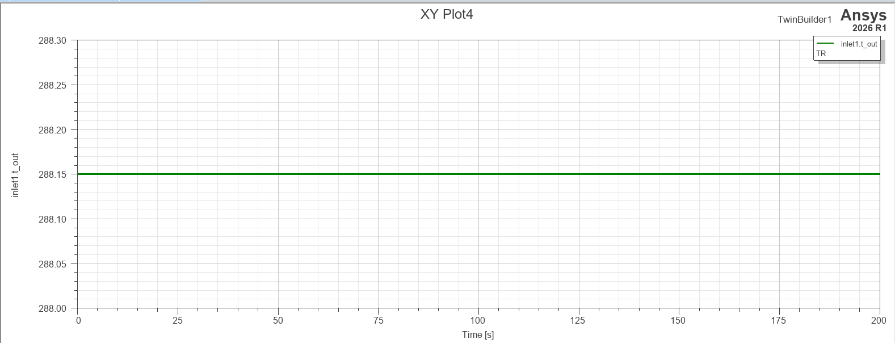
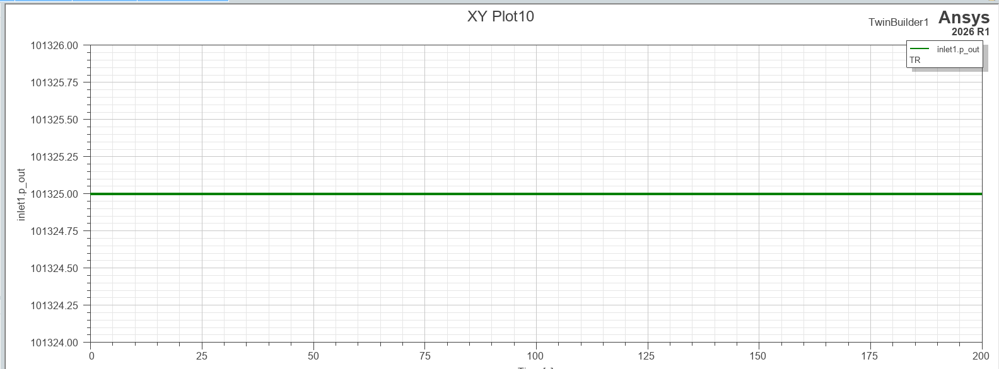

# 01. Inlet (흡입구)

**역할:** 외부 공기를 감속·가압하여 압축기로 전달. ISA 국제표준대기 모델 기반으로 고도·마하수에 따른 대기 조건을 계산.

---

## 모델 개요

| 항목 | 내용 |
|------|------|
| 모델링 언어 | VHDL-AMS |
| 입력 | altitude [m], mach |
| 출력 | t_out [K], p_out [Pa], t_amb [K], p_amb [Pa] |
| 연결 | cfluid_a → Compressor |

## 핵심 파라미터

| 파라미터 | 값 | 설명 |
|----------|----|------|
| t_amb0 | 288.15 K | ISA 해수면 표준 대기온도 (15°C) |
| p_amb0 | 101,325 Pa | ISA 해수면 표준 대기압 (1 atm) |
| γ (gamma) | 1.4 | 공기 비열비 |
| 운용 고도 범위 | 0 ~ 25 km | 대류권 + 성층권 |

---

## 시뮬레이션 결과

### 출구 온도 (inlet1.t_out)

- 정상 상태 수렴값: **288.15 K** (ISA 해수면 기준값과 일치 ✅)
- 고도 0 m, Mach 0 조건에서 대기온도 그대로 출력 — 모델 정상 동작 확인

### 출구 압력 (inlet1.p_out)

- 정상 상태 수렴값: **101,325 Pa** (ISA 해수면 기준값과 일치 ✅)
- Mach ≤ 1 조건에서 압력 손실 없음 (eta_cal = 1.0)

---
