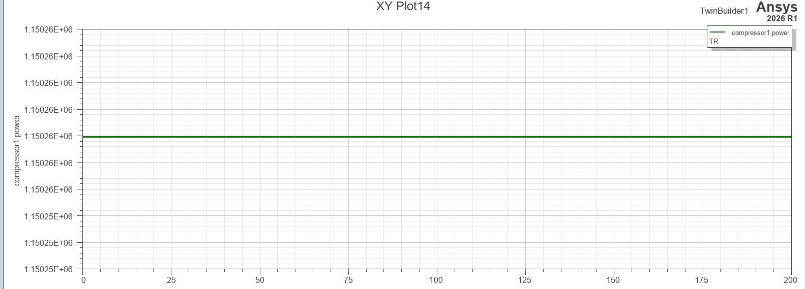

# 02. Compressor (압축기)

**역할:** Inlet에서 유입된 공기를 등엔트로피 압축(압력비 PR배). 열에너지 흡수 후 Combustor로 전달.

---

## 모델 개요

| 항목 | 내용 |
|------|------|
| 모델링 언어 | VHDL-AMS |
| 입력 | t_in (Inlet → Compressor), cfluid_a (압력/질량유량) |
| 출력 | t_out → Combustor, temp_diff → Turbine, power → Shaft |
| 특징 | 5개 컴포넌트 중 유일하게 3개 출력(T, ΔT, P)을 동시에 생산 |

## 핵심 파라미터

| 파라미터 | 값 | 설명 |
|----------|----|------|
| 압축비 (PR) | 10.55 | Honeywell 공식 브로셔 기준 |
| γ (gamma) | 1.4 | 공기 비열비 (이상기체, 상온) |
| 비열 cp | 1004.5 J/(kg·K) | γR/(γ-1) |
| η_comp (압축기 효율) | 0.85 | VHDL 모델 설정값 (등엔트로피 효율) |
> **참고 (문헌 대비):** η_comp = 0.85는 VHDL 모델 설정값입니다. 문헌 기준(Saravanamuttoo, *Gas Turbine Theory*, 2017, Ch.5, 2단 원심압축기 통상범위 0.78~0.82)으로는 η_comp ≈ 0.80이 권장되며, 향후 파라미터 검토 시 참고 바랍니다.
---

## 시뮬레이션 결과

### 압축기 소비 동력 (compressor1.power)

- 정상 상태 수렴값: **1.15026 × 10⁶ W** (약 1,543 SHP)
- 200초 동안 완전한 정상 상태 유지 — 에너지 균형 정상 확인 ✅
- Turbine 생산 동력(1.387 MW)과의 차이가 Shaft를 통해 프로펠러로 전달

---
