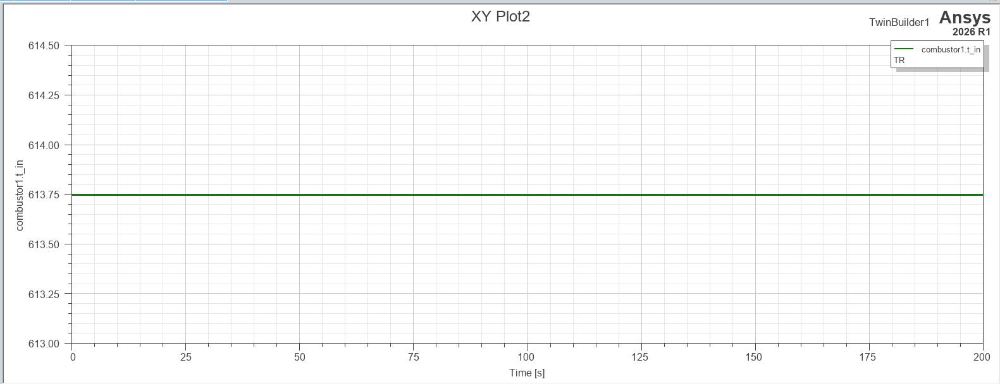
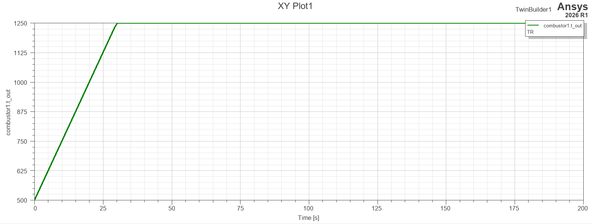

# 03. Combustor (연소기)

**역할:** 압축 공기에 연료를 공급하여 연소. 열에너지를 추가하고 연소가스를 Turbine으로 전달.

---

## 모델 개요

| 항목 | 내용 |
|------|------|
| 모델링 언어 | VHDL-AMS |
| 입력 | t_in [K] (Compressor 출구), cfluid_a, fuel |
| 출력 | t_out [K], fa_ratio (연료공기비), cfluid_b → Turbine |
| 연소실 형식 | 단일 환형(annular) 역류식 |

## 핵심 파라미터

| 파라미터 | 값 | 설명 |
|----------|----|------|
| γ (gamma) | 1.31 | 연소가스 비열비 (공기 1.4와 다름) |
| cp | 1212.5 J/(kg·K) | γR/(γ-1) |
| eff (연소 효율) | 0.96 | VHDL 모델 설정값. 압력 손실 반영: p_out = eff × p_in |
| FAR (연료-공기비) | 0.019 | VHDL 모델 설정값 |
> **참고 (문헌 대비):** eff=0.96, FAR=0.019는 VHDL 모델 설정값입니다. 문헌 기준으로는 η_b ≈ 0.990 (JSSG-2007A §3.2.2.6, 신규 엔진 기준), FAR ≈ 0.018 (Mattingly, *Elements of Gas Turbine Propulsion*, 2006, Ch.9)이 권장됩니다.
---

## 시뮬레이션 결과

### 연소기 입구 온도 (combustor1.t_in)

- 정상 상태 수렴값: **613.75 K** (약 340°C)
- Compressor 출구 온도와 일치 — 컴포넌트 간 연결 정상 확인 ✅

### 연소기 출구 온도 (combustor1.t_out)

- 초기값 500 K → 약 25초 내 **1,250 K** 수렴
- 연소 시작 후 빠르게 온도 상승, 정상 상태 유지 ✅
- 1,250 K = Turbine 입구 온도(TIT) 기준값으로 사용

- > **⚠️ 구조적 고정값 안내:** TIT(T₃)=1,250 K는 VHDL 모델의 설계점 고정값이며, 연소기 에너지평형식 T₃ = T₂ + η_b·FAR·LHV / [cp_air·(1+FAR)] 로 역산되는 값이 아닙니다. VHDL 실제값(η_b=0.96, FAR=0.019)을 대입하면 이론상 T₃ ≈ 1,380 K, 문헌 기준값(η_b=0.990, FAR=0.018)을 대입해도 T₃ ≈ 1,364 K로 산출되어, 두 경우 모두 고정값 1,250 K보다 100 K 이상 높습니다. 즉 TIT는 모델이 계산해서 도출하는 출력이 아니라 부여된 설계 목표값이며, 이 구조적 특성은 논문에 명시할 필요가 있습니다. (상세 계산: `docs/Design_Review.md` 참고)

---
