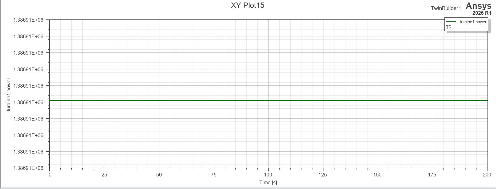
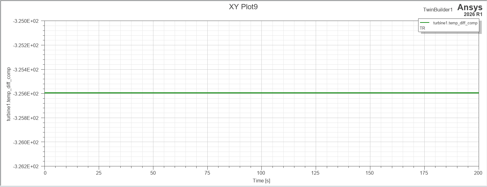

# 04. Turbine (터빈)

**역할:** 연소가스 팽창으로 회전동력 생산. Compressor를 구동하고 잉여 동력을 Shaft를 통해 프로펠러로 전달.

---

## 모델 개요

| 항목 | 내용 |
|------|------|
| 모델링 언어 | VHDL-AMS |
| 입력 | temp_diff_comp (압축기 온도차), far_comb (연료공기비), t_in [K], cfluid_a |
| 출력 | power [W], t_out [K], mech_rv (회전동력 → Shaft) |
| 특징 | Compressor와 달리 rotational_velocity 터미널 추가 — 기계적 커플링 지원 |

## 핵심 파라미터

| 파라미터 | 값 | 설명 |
|----------|----|------|
| eta_t | 0.87 | 터빈 등엔트로피 효율 |
| eta_m | 0.98 | 기계적 효율 |
| γ (gamma) | 1.31 | 연소가스 비열비 |
| cp | 1212.7 J/(kg·K) | γR/(γ-1) |
> **참고 (문헌 대비):** eta_t=0.87은 VHDL 모델 설정값입니다. 문헌 기준(Saravanamuttoo, *Gas Turbine Theory*, 2017, Ch.7)으로는 eta_t ≈ 0.88이 권장됩니다.
> >
> >> ⚠️ 이 값(eta_t, 가스터빈 효율)은 `code/normal.py` Python 교차검증 모델의 `eta_pt`(파워터빈 효율, 0.87, Park et al. 2023)와 숫자가 우연히 같지만 서로 다른 파라미터입니다. eta_pt는 VHDL 5개 컴포넌트에 포함되지 않은 별도 파워터빈 단(EGT 추정용, Python 모델 전용)에 대한 가정값이므로 혼동하지 않도록 주의가 필요합니다.
---

## 시뮬레이션 결과

### 터빈 생산 동력 (turbine1.power)

- 정상 상태 수렴값: **1.38691 × 10⁶ W** (약 1,860 SHP)
- Compressor 소비 동력(1.150 MW) 대비 약 237 kW 잉여 → 프로펠러 구동 동력
- 정상 상태 완전 안정 확인 ✅

### 압축기 온도차 (turbine1.temp_diff_comp)

- 정상 상태 수렴값: **-325.6 K**
- Turbine 출구온도 결정에 핵심 역할 (음수 = 온도 강하)
- Compressor → Turbine 간 신호 연결 정상 확인 ✅

---
